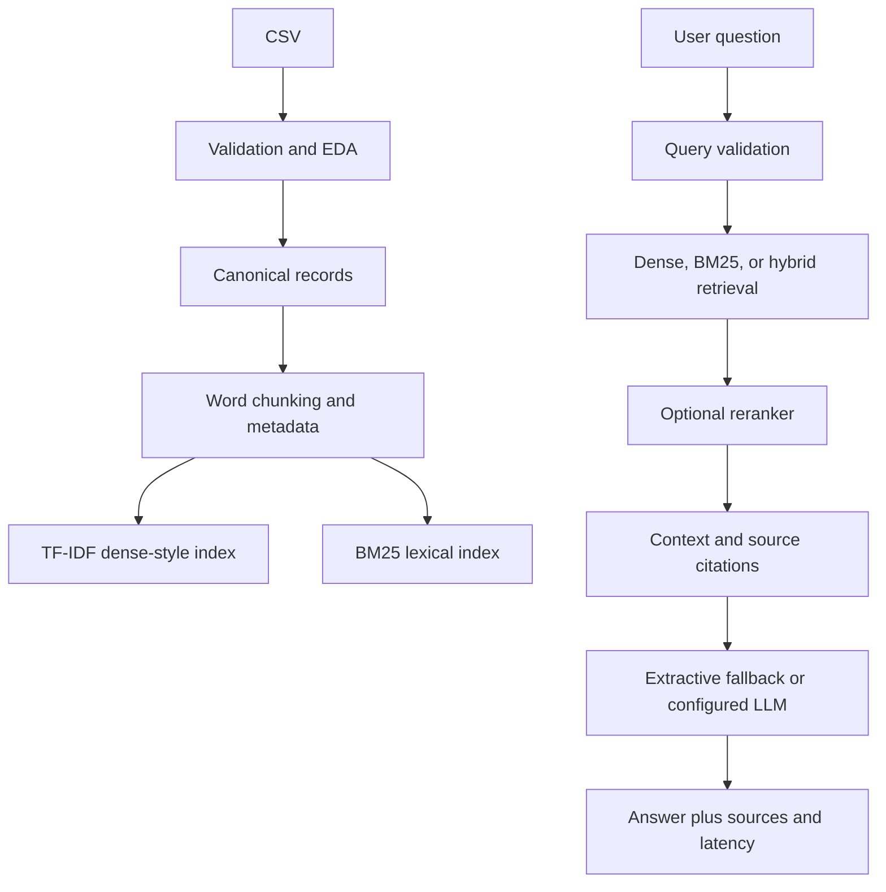

# HelpDeskRAG

**Production-oriented, inspectable Retrieval-Augmented Generation for IT support**

HelpDeskRAG is a portfolio project by **Anwar Hussain**. It demonstrates ingestion, validation, chunking, retrieval, hybrid search, optional reranking, grounded generation, evaluation, observability, API delivery, and a debug-first UI.

## Important Dataset Finding

The supplied file at `archive/rag_question_answer_dataset.csv` is **not** the four-column Kaggle schema described in the brief. It contains 200 rows and 20 columns, including `document_id`, `document_title`, `document`, `question`, and `answer`. It has no nulls and no duplicate rows, but **199 duplicate document bodies**: every body is `AI document`, while every topic/category is constant and the questions and answers are synthetic index strings.

This is a small synthetic diagnostic dataset, not a meaningful IT knowledge corpus. The project reports this limitation rather than turning it into a performance claim. The loader supports both this schema and the intended Kaggle fields (`ki_topic`, `ki_text`, `sample_question`, `sample_ground_truth`). Put the real CSV at `data/rag_question_answer_dataset.csv` to run the same pipeline on it.

## Architecture



## Design Decisions

- **Embeddings/index:** TF-IDF is the default because it is deterministic, local, fast, and available without downloading a model. The adapter boundary is ready for SentenceTransformers when the corpus is replaced with real helpdesk prose.
- **Chunking:** word windows with overlap and stable chunk IDs. The current sample produces one chunk per short document; 400/60 is a reasonable starting point for longer articles and should be tuned with the evaluation notebook.
- **Retrieval:** dense-style TF-IDF, BM25-style lexical scoring, and a normalized hybrid union. Exact lexical terms matter for IT identifiers and commands; semantic embeddings matter for paraphrases.
- **Reranking:** an optional transparent lexical reranker is included. A CrossEncoder is the natural next replacement for a larger, semantically rich corpus.
- **Generation:** deterministic extractive generation is the no-key default. OpenAI is opt-in via `LLM_PROVIDER=openai` and `OPENAI_API_KEY`; the prompt forbids unsupported steps and asks for source citations.
- **Evaluation:** document-level Recall/Hit Rate and MRR use the row's `document_id` as relevance. This is only defensible when document bodies are distinct; on the supplied file it is primarily a data-quality diagnostic.

## Measured Results

Run `python scripts/evaluate.py` to regenerate `evaluation/results/latest.json`. On the checked-in sample, with `top_k=5`:

| Configuration | Hit Rate@5 | Recall@5 | MRR | Mean answer token overlap |
|---|---:|---:|---:|---:|
| Dense | 0.025 | 0.025 | 0.0114 | 0.5125 |
| BM25 | 0.025 | 0.025 | 0.0114 | 0.5125 |
| Hybrid | 0.025 | 0.025 | 0.0114 | 0.5125 |

These are measured values, not production estimates. Identical results are expected because the indexed document text is duplicated. No claim such as “95% accuracy” is appropriate for this file.

### Error Analysis

- **Retrieval failure:** `Question 17` can tie with every other row because the article text is identical. The system may return `Answer 1`; this is caused by corpus duplication, not by a meaningful chunking or model comparison.
- **Semantic mismatch:** none can be evaluated honestly because the document bodies contain no IT semantics.
- **Generation failure:** the extractive fallback can only select from retrieved answer fields. It cannot recover information absent from the retrieved article.
- **Reranking failure:** reranking cannot resolve identical contexts; adding a stronger model would not repair missing source information.
- **Concrete improvement:** replace the synthetic file with distinct knowledge-item text, deduplicate by normalized article content, add relevance labels, and rerun the same experiments.

## Quickstart

```bash
python -m venv .venv
source .venv/bin/activate
pip install -r requirements.txt
cp .env.example .env
python scripts/build_index.py
python scripts/evaluate.py
```

The default path falls back to the inspected archive. For the intended dataset, copy it to `data/rag_question_answer_dataset.csv`.

## Run the Product

```bash
streamlit run app/streamlit_app.py
uvicorn api.main:app --reload
```

API example:

```bash
curl -X POST http://127.0.0.1:8000/query \
	-H 'Content-Type: application/json' \
	-d '{"question":"How do I configure VPN access?","top_k":5,"mode":"hybrid"}'
```

The response contains `answer`, user-facing `sources`, retrieved chunks, retrieval method/candidate count, and generation/reranking/total latency. The Streamlit debug mode exposes the same path visually.

## Configuration

All secrets stay outside source control. Configure `.env` with `EMBEDDING_MODEL`, `LLM_PROVIDER`, `LLM_MODEL`, `VECTOR_STORE`, chunk settings, and `TOP_K`. `extractive` is local and keyless. `openai` is optional and only used when an API key is present. Never commit `.env`.

## Repository Layout

```text
app/streamlit_app.py       Debuggable chat UI
api/main.py                FastAPI /health and /query
src/helpdesk_rag/          Reusable loading, chunking, retrieval, generation, evaluation
scripts/                   Build and evaluation entry points
notebooks/                 EDA, baseline, and evaluation walkthroughs
tests/                     Focused pytest coverage
configs/                   Human-readable defaults
data/                      User-provided corpus location
evaluation/                Measured JSON results and report notes
```

## Tests

```bash
pytest -q
python -m compileall -q src api app scripts
```

## Scaling Path

For 100 to 10,000 articles, replace the local matrix with FAISS or Qdrant, batch SentenceTransformer embeddings, persist document hashes for incremental ingestion, and filter by topic/access metadata before retrieval. Add response and embedding caches, async API execution, structured logs and trace IDs, model/version tracking, scheduled retrieval and answer evaluations, and dashboards for latency and empty-context rates. Deploy the API behind authentication and rate limits; redact sensitive ticket data and enforce document-level access control before indexing. A managed vector store is useful at scale, but it is unnecessary complexity for this 200-row sample.

## Portfolio Summary

Designed and implemented an evaluation-first RAG application for IT support knowledge items, including schema-tolerant ingestion, data-quality profiling, configurable chunking, dense/lexical hybrid retrieval, optional reranking, grounded fallback generation, source citations, latency instrumentation, FastAPI delivery, Streamlit inspection, reproducible experiments, and pytest coverage. Explicitly diagnosed the supplied synthetic corpus as unsuitable for production accuracy claims.

## Interview Preparation

1. **Why hybrid retrieval?** Dense retrieval handles paraphrases, while lexical retrieval preserves exact IT terms, identifiers, and commands; the union improves recall when either signal is weak.
2. **Why not claim high accuracy here?** The corpus has 199 duplicate document bodies, so measured document relevance is confounded by ties and cannot generalize.
3. **How is grounding controlled?** The prompt restricts answers to context, the fallback selects only retrieved text/answers, and no-context queries return an explicit insufficiency response.
4. **Why keep an extractive fallback?** It makes local demos reproducible and usable without an API key while retaining a clean provider boundary.
5. **What does MRR measure?** The reciprocal rank of the first relevant document, averaged over questions; it rewards finding the right source early.
6. **How would you improve retrieval on real data?** Normalize and deduplicate articles, tune chunk sizes, add metadata filters, use a stronger embedding model, then compare recall and MRR on labeled queries.
7. **Why stable chunk IDs?** They make citations, debugging, experiment comparisons, and incremental index updates traceable.
8. **What would you monitor in production?** Retrieval latency, candidate count, score distributions, empty-context rate, generation latency, citation coverage, user feedback, and drift by topic/model version.
9. **How do you secure it?** Keep keys in environment/secret storage, validate request length and mode, avoid returning internal configuration, redact sensitive content, and enforce access filters before retrieval.
10. **What is the main next architectural step?** Replace the local TF-IDF matrix with a persistent vector store and SentenceTransformer embeddings after obtaining a genuinely diverse knowledge-item corpus and labeled evaluation set.

## Author

**Anwar Hussain**
